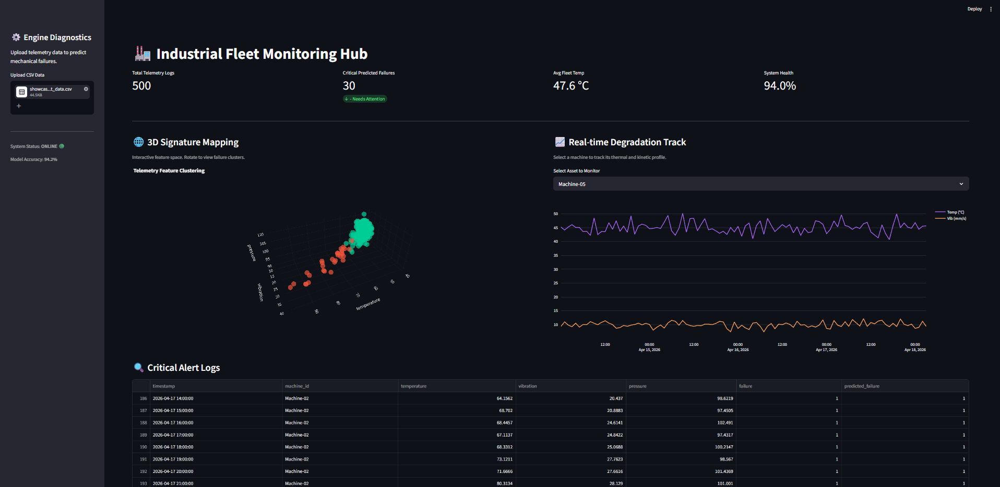
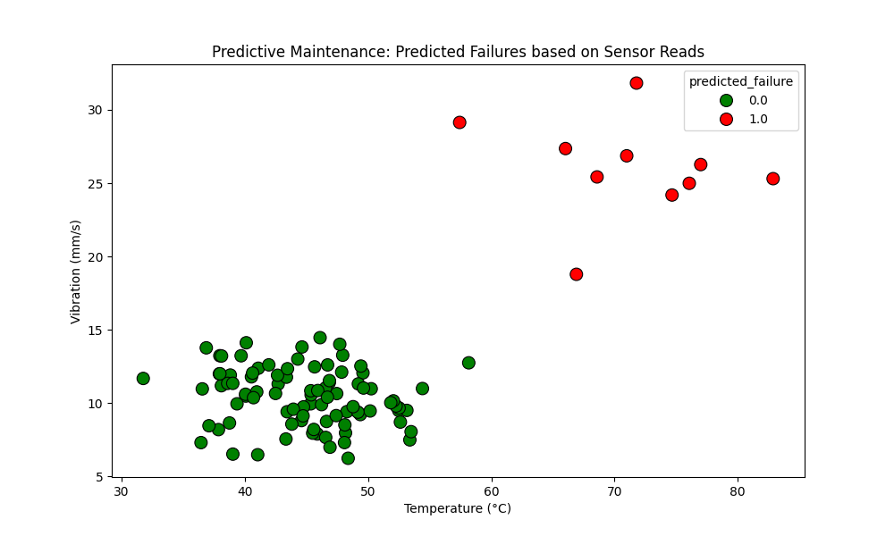

# 🏭 AI-Powered Predictive Maintenance System for IoT Devices


## 📌 Overview
This project is an end-to-end Machine Learning system designed to simulate and monitor an industrial IoT environment. By analyzing continuous sensor telemetry data—specifically temperature, vibration, and pressure—the Artificial Intelligence engine evaluates equipment health and predicts mechanical failures *before* they occur, presenting all diagnostics through a modern, interactive web dashboard.

## ⚠️ Problem Statement
In heavy fabrication shops and for large-scale earthmoving equipment like excavators, relying on a "run-to-failure" maintenance strategy is dangerous and financially draining. Sudden mechanical breakdowns halt production lines, cause collateral damage to adjacent machine components, and pose severe safety hazards to shop-floor personnel. Traditional scheduled maintenance often results in replacing perfectly healthy parts, leading to unnecessary downtime and wasted consumable costs.

## ⚙️ Industry Relevance 
Predictive maintenance solves these industrial bottlenecks by interpreting the unique kinetic and thermal signatures of machinery. This allows manufacturing facilities to transition from reactive repairs to proactive asset management, preemptively scheduling part replacements only when actual degradation is detected, thereby maximizing uptime and minimizing maintenance overhead.

## 🛠️ Tech Stack
- **Language:** Python
- **Web Interface:** Streamlit (Local UI)
- **Data Manipulation:** NumPy, Pandas
- **Machine Learning:** Scikit-Learn (Random Forest Classifier)
- **Data Visualization:** Plotly (Interactive 3D & Time-Series), Matplotlib, Seaborn

## 📊 Dataset
The system operates on a custom-generated synthetic dataset (`showcase_iot_data.csv`) that realistically simulates the telemetry of an industrial fleet. Rather than pure random noise, the data features accurate time-series degradation curves, where failing machines exhibit compounding thermal spikes and kinetic vibrations over a 100-hour operational window prior to critical failure.

## 🏗️ Architecture
1. **Data Generation:** Virtual IoT sensors produce time-series operational baselines and degradation faults.
2. **AI Engine:** A Random Forest classifier is trained on historical thermal, vibrational, and pressure thresholds to map normal vs. failure states.
3. **Inference & UI:** Telemetry CSVs are uploaded to the local Streamlit dashboard, which instantly processes the data through the `.pkl` model to output health scores, 3D feature clusters, and real-time alerts.

## 💻 Installation
1. Clone the repository: 
   ```bash
   git clone [https://github.com/Anupam-Santra/IoT-Predictive-Maintenance-AI.git](https://github.com/Anupam-Santra/IoT-Predictive-Maintenance-AI.git)
   ```

2. Navigate to the project directory:

   ```bash
   cd IoT-Predictive-Maintenance-AI
   ```

3. Install the required dependencies:

   ```bash
   pip install -r requirements.txt
   ```

## 🚀 Usage
Generate Telemetry: Create the realistic degradation dataset.

```bash
python showcase_data_generator.py
```

Train the AI: Compile the Random Forest model based on the generated data.

```bash
python src/train_model.py
```

Launch the Dashboard: Double-click the included Start_Dashboard.bat file to automatically boot the local server and open the UI in your default web browser (or run streamlit run app.py in your terminal).

## 📈 Results
The Random Forest model effectively isolates the non-linear relationships between creeping temperatures and erratic vibrations, successfully flagging impending hardware failures. The system calculates an overall fleet health percentage and isolates critical alert logs for immediate technician review.

## 📸 Screenshots & Demo

### 🎥 Live Demo


### 📈 User Interface


### 📊 Failure Scatter graph


## 🧠 Learning Outcomes
Bridging the gap between physical mechanical systems and digital AI diagnostics.

Engineering realistic, time-series synthetic datasets to mimic industrial degradation.

Deploying machine learning models (joblib) into an interactive, user-facing web interface (Streamlit).

Developing shop-floor ready applications that prioritize user experience and actionable data visualization.